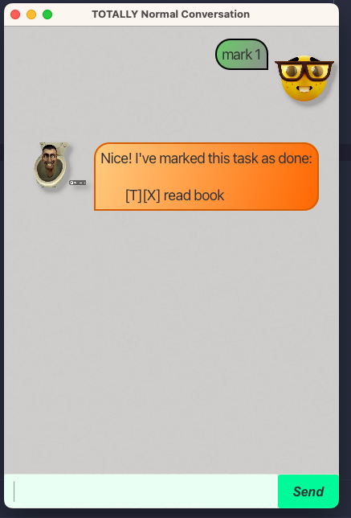

# **GreenFloyd User Guide**

## **📌 Introduction**
Welcome to **GreenFloyd**, your smart task management chatbot!
GreenFloyd helps you organize your **Todos, Deadlines, and Events** effortlessly through simple commands.

🛠 **Key Features:**  
✅ Create tasks quickly  
✅ Set deadlines and events  
✅ Mark tasks as completed  
✅ Search tasks by keyword  
✅ Auto-save tasks between sessions

---

## **🖼 Product Screenshot**


---

## **🚀 Installation & Setup**
### **Windows / macOS / Linux**
1. Download the latest `duke.jar` (ver 0.2) from [Releases](https://github.com/Noob-No-1/ip/releases/tag/New-Release).
2. Open a terminal and navigate to the folder containing `duke.jar`.
3. Run the chatbot using:
   ```sh
   java -jar duke.jar
   ```
4. The chatbot window should open, and you can start entering commands!

---

## **📅 Adding Deadlines**
### **📝 Description:**
The `deadline` command adds a task with a specific due date.

### **💡 Usage Example:**
```sh
deadline Submit report /by 25/01/2025 1600
```

### **🔍 Expected Output:**
```
Got it! Added: [D] Submit report (by: Jan 25, 2025 4pm)
```

---

## **✅ Adding Todos**
### **📝 Description:**
The `todo` command adds a simple task without a deadline.

### **💡 Usage Example:**
```sh
todo Buy groceries
```

### **🔍 Expected Output:**
```
Got it! Added: [T] Buy groceries
```

---

## **📆 Adding Events**
### **📝 Description:**
The `event` command adds an event with a start and end time.

### **💡 Usage Example:**
```sh
event Team meeting /from 25/01/2025 1400 /to 25/01/2025 1600
```

### **🔍 Expected Output:**
```
Got it! Added: [E] Team meeting (from: Jan 25, 2025 2pm to: Jan 25, 2025 4pm)
```

---

## **📜 Listing All Tasks**
### **📝 Description:**
The `list` command displays all tasks currently saved.

### **💡 Usage Example:**
```sh
list
```

### **🔍 Expected Output:**
```
1. [T][ ] Buy groceries
2. [D][ ]Submit report (by: Jan 25, 2025 4pm)
3. [E][ ] Team meeting (from: Jan 25, 2025 2pm to: Jan 25, 2025 4pm)
```

---

## **✅ Marking Tasks as Completed**
### **📝 Description:**
The `mark` command marks a task as done.

### **💡 Usage Example:**
```sh
mark 2
```

### **🔍 Expected Output:**
```
Nice! I've marked this task as done:
[D][X] Submit report (by: Feb 20, 2025)
```

---

## **🚫 Deleting Tasks**
### **📝 Description:**
The `delete` command removes a task from the list.

### **💡 Usage Example:**
```sh
delete 1
```

### **🔍 Expected Output:**
```
Noted. I've removed this task:
[T] Buy groceries
```

---

## **🔍 Finding Tasks**
### **📝 Description:**
The `find` command searches for tasks containing a specific keyword.

### **💡 Usage Example:**
```sh
find report
```

### **🔍 Expected Output:**
```
Here are the matching tasks in your list:
1. [D] Submit report (by: Feb 20, 2025 4pm)
```

---

## **💾 Auto-Saving & Loading Tasks**
### **📝 Description:**
Tasks are automatically saved to `data/task_history.txt` and loaded when the chatbot restarts.

---

## **❓ FAQ**
### **Q: Can I edit a task?**
❌ No, but you can delete and re-add a task.

### **Q: How does the chatbot save tasks?**
✅ All tasks are saved in `data/task_history.txt`.

---

## **🎉 Happy Task Managing with GreenFloyd!**
💬 Questions? Open an **issue** on GitHub!

